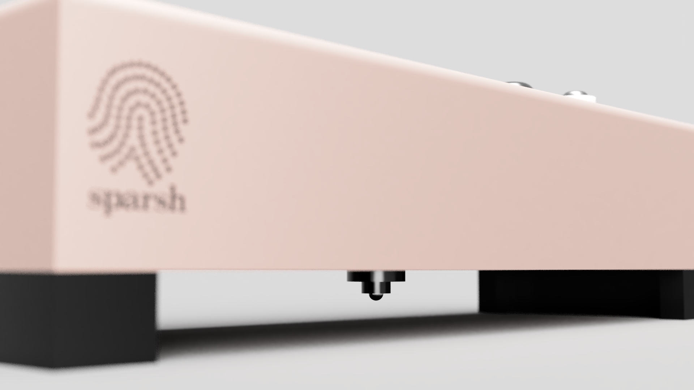
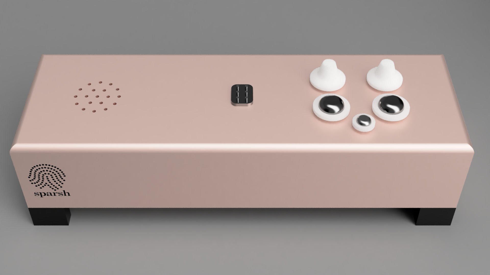
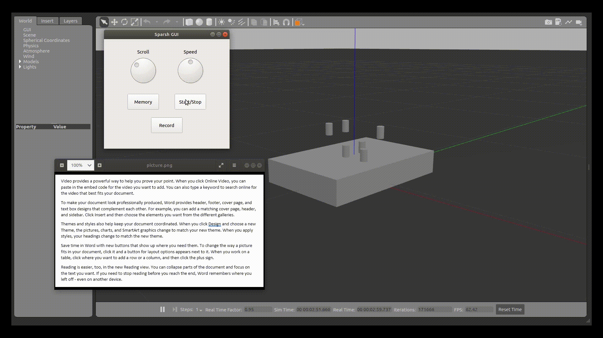
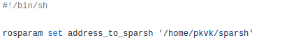
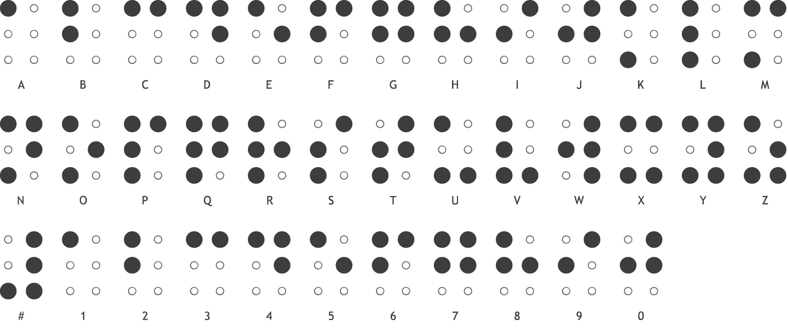

# Sparsh


## HackOff 3.0 project. A braille reader for everything!

### Team Name: Team Suroor
### Track: Robotics, Beginners
### Members: Keshav Kapur, Kvk Praneeth, and Raghav Thakar
### The future is accessible, and this is how we get there.

Sparsh is an open-source hardware solution that aims to make reading more accessible for the visually impaired. It does so by extracting text from any document using OCR (Optical Character Recognition). The text is then translated into Braille and/or Voice feedback, which is sequentially outputted through physical actuation. The rate of translation, and the exact moment at which translation is to be started or stopped can be controlled using a reliable hardware user-interface.

Sparsh is a low-cost solution to other market alternatives that can cost well into lakhs of rupees. 6 cylindrical actuators actuate sequentially to give a tactile feedback of text, along with a speaker and headphone jack for Voice feedback.

For the purpose of a viable demo of the hack at HackOff 3.0, this repository contains a GUI replica of the device’s hardware interface. Physical actuations have been simulated using Gazebo. Robot Operating System (ROS) was used to interface the hardware replica with software.

Sparsh comes with the following functionalities:
-    Reading physical documents and translating to Braille/Voice
-    Recording and storing text locally in memory
-    Recalling text from memory
-    Translating text from PDFs, TXT files, and even Images!






Dependecy list to run the simulation and the gui:

* Python 2 
* Python 3
* ROS barebones
* PyQt5 (pip3)
* pyttsx3 (pip3)
* pyttsx (pip2)
* espeak (sudo apt install espeak)
* Gazebo
* pyyaml(pip3)
* pyyaml(pip2)
* datetime(pip3)
* PyPDF2(pip)
* Opencv-python(pip)
* Numpy(pip)
* pytesseract(pip)

Setting up the directory:


```
cd ~/sparsh/src/gui/scripts
```
Open the text file and replace your laptop's id inside the setup.sh



```
roscore

source setup.sh
```

To run the gui:
```
cd ~/sparsh/src/gui/scripts/ && python3 sparsh_gui_1.py
```

To run the simulation on Gazebo:
```
cd ~/sparsh

catkin_make

source devel/setup.bash

roslaunch sparsh_computation sparsh.launch
```

Chart for reference for Braille:




